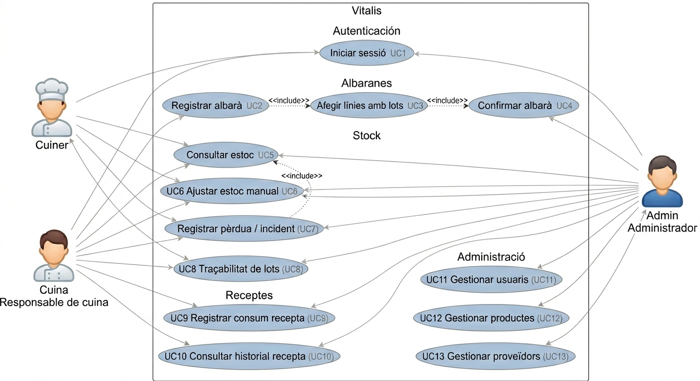
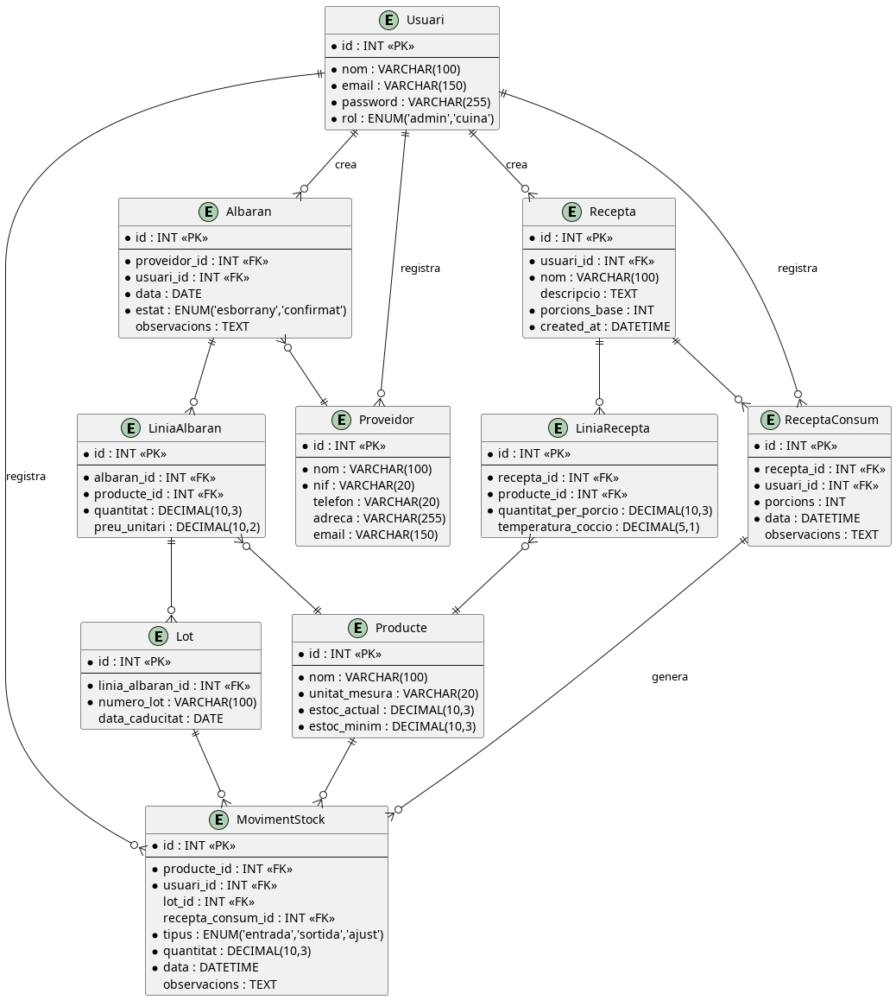

# VITALIS
## Sistema de Gestió d'Albarans i Estoc per a Cuines Professionals
**Estudi Previ — Projecte de Fi de Cicle (DAW)**  
**Curs:** 2025–2026  
**Grup:** Antonio Jiménez i David Moya

---

## 1. Descripció del sistema

**Nom del projecte:** Vitalis

**Idea principal:**
Vitalis és una aplicació web dissenyada per a cuines centrals i empreses de càtering que encara gestionen l'estoc i els albarans en paper o en fulls de càlcul. L'objectiu és digitalitzar i centralitzar quatre processos clau: l'entrada de mercaderia mitjançant albarans digitals, el control d'estoc en temps real, la traçabilitat per lots de cada ingredient i la gestió de receptes amb descàrrega automàtica d'estoc.

Amb Vitalis, el responsable de cuina pot registrar un albaran en el moment en què arriba la mercaderia, consultar l'estoc actual de qualsevol producte, saber en tot moment de quin proveïdor i de quin lot prové cada ingredient, i registrar el consum d'una recepta perquè el sistema descompti automàticament els ingredients de l'estoc. Això redueix els errors manuals, estalvia temps administratiu i facilita el compliment de la normativa sanitària.

**Problema que resol:**
- Els albarans en paper es perden o s'acumulen sense processar-se.
- L'estoc es controla a ull o amb fulls de càlcul desactualitzats.
- En cas d'alerta sanitària, és impossible rastrejar ràpidament els lots afectats.
- El traspàs d'informació entre el moment de recepció i la cuina és lent i poc fiable.
- Els consums d'ingredients per recepta es registren manualment o no es registren, fet que provoca desviacions constants entre l'estoc real i el teòric.

**Usuari objectiu:** Responsables de compres i caps de cuina de cuines centrals i empreses de càtering de mida petita o mitjana.

---

## 2. Requisits del sistema

### Requisits funcionals

| Codi | Descripció |
|------|------------|
| RF1  | Registrar i autenticar usuaris amb rols diferenciats (administrador, responsable de cuina, cuiner). |
| RF2  | Gestionar el catàleg de productes (nom, unitat de mesura, estoc mínim, al·lèrgens). |
| RF3  | Gestionar el catàleg de proveïdors. |
| RF4  | Crear i registrar albarans d'entrada de mercaderia associats a un proveïdor. |
| RF5  | Registrar lots per a cada línia d'albaran (número de lot, data de caducitat). |
| RF6  | Actualitzar l'estoc automàticament en confirmar un albaran. |
| RF7  | Consultar l'estoc actual de cada producte en temps real. |
| RF8  | Consultar la traçabilitat d'un lot: quin albaran l'ha introduït i quan. |
| RF9  | Generar alertes visuals quan un producte estigui per sota de l'estoc mínim. |
| RF10 | Administrar usuaris (crear, editar, desactivar). |
| RF11 | Registrar moviments de sortida d'estoc de forma manual per part del personal de cuina. |
| RF12 | Registrar moviments d'ajust d'estoc (pèrdues, errors, regularitzacions). |
| RF13 | Consultar l'historial complet de moviments d'estoc per producte. |
| RF14 | Calcular el consum de productes a partir dels moviments de sortida. |
| RF15 | Gestionar el catàleg de receptes: crear, editar i eliminar receptes amb el seu nom, descripció, nombre de porcions base i la llista d'ingredients amb les quantitats necessàries per porció. |
| RF16 | Registrar el consum d'una recepta indicant el nombre de porcions produïdes: el sistema generarà automàticament moviments de sortida d'estoc (`MovimentStock`) per a cadascun dels ingredients de la recepta, proporcionals a les porcions introduïdes. |
| RF17 | Consultar l'historial de produccions d'una recepta: data, porcions, usuari que ho ha registrat i moviments d'estoc generats. |
| RF18 | Bloquejar o avisar el registre de consum d'una recepta si algun ingredient no disposa d'estoc suficient. |

### Requisits no funcionals

| Categoria | Requisit |
|-----------|----------|
| Seguretat | Autenticació amb tokens JWT i contrasenyes encriptades amb bcrypt. |
| Rendiment | L'API ha de respondre en menys de 2 segons en condicions normals. |
| Usabilitat | Interfície responsive, usable des de tauleta o ordinador a la cuina. |
| Disponibilitat | Disponibilitat mínima del 99% durant horari laboral. |
| Mantenibilitat | Codi documentat i estructurat per facilitar extensions futures. |

---

## 3. Actors del sistema

| Actor | Accions principals |
|-------|--------------------|
| Visitant | Accedeix a la pàgina de login. No té accés a cap funcionalitat fins que s'autentica. |
| Responsable de cuina | Registra albarans, consulta l'estoc, consulta traçabilitat de lots, gestiona productes i proveïdors, gestiona receptes i registra consums per recepta. |
| Cuiner | Consulta l'estoc, verifica disponibilitat d’ingredients, registra pèrdues/incidències i registra consum de receptes.|
| Administrador | Té accés a totes les funcionalitats del sistema i, a més, gestiona els usuaris. |

### Casos d'ús principals

- **Responsable de cuina:** iniciar sessió → registrar albaran → afegir línies amb lots → confirmar albaran → estoc actualitzat automàticament.
- **Responsable de cuina:** consultar estoc → identificar productes sota mínims → actuar (compra o ajust).
- **Responsable de cuina:** ajustar estoc manualment → corregir diferències detectades
- **Responsable de cuina:** registrar pèrdua / incidència → el sistema ajusta automàticament l’estoc.
- **Responsable de cuina:** cercar un lot → veure l'albaran d'origen → veure proveïdor i data d'entrada.
- **Responsable de cuina:** seleccionar una recepta → indicar porcions produïdes → confirmar consum → el sistema genera moviments de sortida per cada ingredient i actualitza l'estoc.
- **Responsable de cuina:** consultar l'historial de produccions d'una recepta → veure consum acumulat d'ingredients.
- **Cuiner:** iniciar sessió → consultar estoc → verificar disponibilitat d’ingredients.
- **Cuiner:** consultar estoc → detectar mancances → informar al responsable.
- **Cuiner:** registrar pèrdua / incidència → el sistema ajusta automàticament l’estoc.
- **Cuiner:** seleccionar una recepta → indicar porcions produïdes → confirmar consum → el sistema actualitza l’estoc.
- **Cuiner:** consultar historial de receptes → veure produccions anteriors.
- **Administrador:** iniciar sessió → accedir al sistema.
- **Administrador:** crear o desactivar comptes d'usuari.


## Diagrama de casos d'ús 



---

## 4. Model conceptual

### Entitats principals

| Entitat | Atributs principals |
|---------|---------------------|
| Usuari | id, nom, email, password, rol (admin \| responsable_cuina \| cuiner) |
| Proveïdor | id, nom, nif, telèfon, adreça, email |
| Producte | id, nom, unitat_mesura, estoc_actual, estoc_minim |
| Albaran | id, proveïdor_id, usuari_id, data, estat (esborrany \| confirmat), observacions |
| LiniaAlbaran | id, albaran_id, producte_id, quantitat, preu_unitari |
| Lot | id, linia_albaran_id, numero_lot, data_caducitat |
| MovimentStock | id, producte_id, lot_id, usuari_id, recepta_consum_id, tipus (entrada \| sortida \| ajust), quantitat, data, observacions |
| Recepta | id, nom, descripcio, porcions_base, usuari_id, created_at |
| LiniaRecepta | id, recepta_id, producte_id, quantitat_per_porcio, temperatura_coccio |
| ReceptaConsum | id, recepta_id, usuari_id, porcions, data, observacions |

### Relacions clau

- Un Proveïdor pot tenir N Albarans.
- Un Albaran té N LiniesAlbaran.
- Cada LiniaAlbaran fa referència a un Producte i pot tenir N Lots.
- En confirmar un Albaran, el sistema crea moviments d'entrada (`MovimentStock`) i actualitza l'`estoc_actual` de cada Producte.
- Una Recepta té N LiniesRecepta, cadascuna referenciada a un Producte amb la seva `quantitat_per_porcio`.
- En registrar un ReceptaConsum (amb un nombre de porcions), el sistema crea automàticament N moviments de sortida (`MovimentStock`) —un per cada ingredient de la recepta— i actualitza l'estoc.
- Un MovimentStock pot tenir opcionalment un `recepta_consum_id` per indicar que prové d'una producció de recepta, mantenint la traçabilitat completa.
- La traçabilitat es resol consultant: `Lot → LiniaAlbaran → Albaran → Proveïdor`.

### Esquema de relacions

```
Usuari (1) ──── (N) Albaran (N) ──── (1) Proveïdor
                      │
                      └── (N) LiniaAlbaran (N) ──── (1) Producte ──── (N) LiniaRecepta
                                  │                        │                    │
                                  └── (N) Lot              │               (1) Recepta
                                                           │                    │
                                              (N) MovimentStock ◄── (1) ReceptaConsum
                                                (entrada | sortida | ajust)
```

### Model de dades



---

## 5. Disseny inicial de la interfície

### Pantalles principals del MVP

| Pantalla | Descripció |
|----------|------------|
| Login | Formulari d'accés amb email i contrasenya. |
| Dashboard | Resum de l'estoc: productes sota mínims, últims albarans, últimes produccions de receptes, accions ràpides. |
| Llistat d'albarans | Taula amb tots els albarans (filtrables per data i proveïdor). Botó per crear-ne un de nou. |
| Formulari d'albaran | Capçalera (proveïdor, data) + línies de producte amb quantitat i lots. Botó de confirmació. |
| Consulta d'estoc | Taula de productes amb estoc actual. Alertes visuals per sota del mínim. |
| Ajust manual d'estoc | Formulari per modificar quantitats manualment amb motiu del canvi. |
| Registre d'incidències | Formulari per registrar pèrdues o errors amb impacte automàtic en l'estoc. |
| Traçabilitat de lots | Cercador per número de lot. Mostra albaran d'origen, proveïdor i data d'entrada. |
| Llistat de receptes | Taula amb totes les receptes. Botó per crear-ne una de nova i per registrar un consum. |
| Formulari de recepta | Nom, descripció, porcions base + línies d'ingredients amb quantitat per porció. |
| Registre de consum de recepta | Selecció de recepta, indicació de porcions produïdes, resum d'ingredients que es descomptaran i alerta si algun no té estoc suficient. Botó de confirmació. |
| Gestió d'usuaris (admin) | CRUD d'usuaris del sistema. |

El disseny seguirà un estil net i funcional, prioritzant la llegibilitat en condicions de cuina (tipus de lletra gran, botons clars, poc soroll visual). La navegació principal serà una barra lateral persistent.

---

## 6. Tecnologies utilitzades

| Capa | Tecnologia | Justificació |
|------|------------|--------------|
| Frontend | React + TailwindCSS | SPA reactiva, component-based, estil utilitari àgil. |
| Backend | Laravel (PHP) + API REST | Framework madur, ORM Eloquent, sistema de rols senzill. |
| Base de dades | MySQL | Relacional, àmpliament suportat, adequat per al model de dades. |
| Autenticació | Laravel Sanctum (JWT) | Tokens d'API lleugers, integrats amb el frontend React. |
| Control de versions | Git + GitHub | Treball col·laboratiu entre els dos membres de l'equip. |
| Desplegament | Render / Railway (backend) + Vercel (frontend) | Gratuïts per a projectes acadèmics, desplegament senzill. |

### Arquitectura del sistema

```
┌─────────────────────┐        HTTP / REST        ┌──────────────────────┐
│                     │ ────────────────────────► │                      │
│   React (Vercel)    │                           │  Laravel API (Render)│
│   SPA Frontend      │ ◄──────────────────────── │  Lògica de negoci    │
│                     │        JSON responses      │  Autenticació / Rols │
└─────────────────────┘                           └──────────┬───────────┘
                                                             │
                                                             ▼
                                                   ┌─────────────────────┐
                                                   │      MySQL          │
                                                   │  Productes, Lots,   │
                                                   │  Albarans, Usuaris  │
                                                   │  Receptes, Consums  │
                                                   └─────────────────────┘
```

---

## 7. Abast del projecte

### MVP — Nucli (220 hores)

| Funcionalitat | Estat |
|---------------|-------|
| Autenticació i rols (admin / cuina) | ✅ MVP |
| CRUD de productes i proveïdors | ✅ MVP |
| Registre i confirmació d'albarans | ✅ MVP |
| Gestió de lots per línia d'albaran | ✅ MVP |
| Actualització automàtica d'estoc | ✅ MVP |
| Alertes per estoc sota mínims | ✅ MVP |
| Consulta de traçabilitat per lot | ✅ MVP |
| Gestió d'usuaris (admin) | ✅ MVP |
| CRUD de receptes amb ingredients | ✅ MVP |
| Registre de consum per recepta amb descàrrega automàtica d'estoc | ✅ MVP |
| Historial de produccions per recepta | ✅ MVP |
| Alerta d'estoc insuficient en registrar consum de recepta | ✅ MVP |
| Mòdul FIFO de consums | 🔜 Extensió futura |
| Menús setmanals i al·lèrgens | 🔜 Extensió futura |
| Exportació d'informes en PDF | 🔜 Extensió futura |

L'arquitectura i el model de dades del MVP estaran dissenyats per permetre l'addició d'aquests mòduls en fases posteriors sense reestructuracions majors.

---

## 8. Planificació inicial

| Fase | Descripció | Hores estimades |
|------|------------|-----------------|
| 1 | Estudi previ i disseny del model de dades | 20 h |
| 2 | Configuració de l'entorn i base del projecte | 10 h |
| 3 | Backend: autenticació, CRUD productes/proveïdors | 30 h |
| 4 | Backend: albarans, lots i lògica d'estoc | 40 h |
| 5 | Backend: receptes, línies de recepta i consum amb descàrrega d'estoc | 20 h |
| 6 | Frontend: login, dashboard, estoc | 30 h |
| 7 | Frontend: albarans, lots, traçabilitat | 30 h |
| 8 | Frontend: receptes i registre de consum | 20 h |
| 9 | Integració, proves i correcció d'errors | 20 h |
| 10 | Documentació i desplegament | 15 h |
| **TOTAL** | | **235 h** |

---